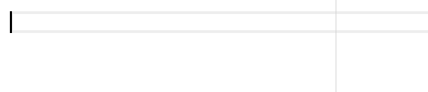
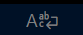
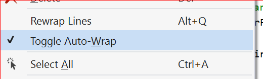

# Auto-wrap #

Auto-wrap works like the [auto-fill mode](https://www.gnu.org/software/emacs/manual/html_node/emacs/Auto-Fill.html) in Emacs. When pressing \<space\> or \<enter\> after the cursor is past the wrapping column, that line is wrapped onto the next.

Like in the Emacs function, auto-wrap does not attempt to re-flow the entire paragraph; it only adds a break in the current line. It's handy when typing new text, but won't automatically fix a paragraph after inserting/removing text. For this you can always do a standard `alt+q` after making edits.

## Settings ##
<!-- tabs:start -->

### **VS Code**

Auto-wrap is disabled by default, but can be enabled with the **Rewrap&nbsp;>&nbsp;Auto&nbsp;Wrap:&nbsp;Enabled** setting. This setting (`rewrap.autoWrap.enabled`) can also be [set per language/document type](https://code.visualstudio.com/docs/getstarted/settings#_languagespecific-editor-settings).

Even when enabled, it will only activate within comments in code files, not on code lines, so it's usually ok to leave it enabled.

To temporarily enable or disable auto-wrap *for the current document*, you can use the **Rewrap:&nbsp;Toggle&nbsp;Auto-Wrap** command in the command palette.

To help keep track of when auto-wrap is on or off, there is a small (optional, but on by default) icon/notification in the right of the statusbar, that shows the auto-wrap state for the current document. It has 4 states:
*  (normal): on, enabled in settings
*  (hidden): off, disabled in settings
*  (orange): temporarily enabled, from toggle command
*  (gray): temporarily disabled, from toggle command

Hovering over this icon will give more information.

If you don't like the icon, [you can hide it](https://code.visualstudio.com/updates/v1_36#_hide-individual-status-bar-items), or change the **Rewrap&nbsp;>&nbsp;AutoWrap:&nbsp;Notification** setting to **text**. Then it will instead show a brief text message in the status bar for a few seconds whenever auto-wrap is toggled on or off.

There's no default keybinding for the toggle command, but you can add one, eg `shift+alt+q`, by binding to the command ID `rewrap.toggleAutoWrap` [in the Keyboard Shortcuts editor](https://code.visualstudio.com/docs/getstarted/keybindings).

### **Visual Studio**

Auto-wrap is turned off by default. Turning it on is global: it affects all documents edited. In code files, only comments will be affected, so it's pretty safe to leave it on.

On the **Edit** menu, under the *Rewrap Lines* command, is the *Toggle Auto-Wrap* item.

The check-mark shows the status and a brief statusbar message is shown when turning on/off.

To add a keybinding for the toggle command, go to *Tools* -> *Options*, then *Environment* -> *Keyboard*. In this dialog pane search for the command `Edit.ToggleAutoWrap` and you can assign a shortcut key to it.

<!-- tabs:end -->
