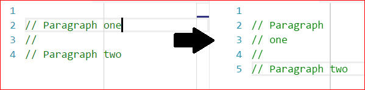

# Configuration in Visual Studio

Configure through the *Rewrap* section of Tools > Options. Settings can be made globally,
or per language/file type group.

## Wrapping column

The recommended way to set a wrapping column is to use a ruler (see below), which also
gives a visual indication. If you don't want to do that, then you can use the "Wrapping
column" setting. a value of `80` for example will wrap after 80 characters.

### Wrapping to rulers

To enable wrapping to rulers, the "Wrapping column" setting must be left blank.

  

Visual Studio doesn't come with a rulers feature, so this is done in combination with the
[Editor Guidelines](
https://marketplace.visualstudio.com/items?itemName=PaulHarrington.EditorGuidelines)
extension. Once that extension is installed, you can right-click in the editor to add
guidelines manually, or you can [set them up in an .editorconfig file](
https://github.com/pharring/EditorGuidelines#editorconfig-support-vs-2017-or-above).

If you have multiple rulers, you can [choose which ruler to wrap to while editing
](extra-features.md/#multiple-rulers-set).

## Wrap whole comments

With "Wrap whole comments" set to `true` (default), Rewrap will wrap a whole comment block
when a text cursor is inside it.

But when set to `false`, Rewrap will only wrap that paragraph within the comment.

\
(Here the second paragraph is not wrapped)

**Note:** This setting only affects empty selections. You can always manually select the
lines to wrap.

## Double sentence spacing

If enabled, whenever a paragraph is wrapped, for any lines that end in ".", "?" or "!",
two spaces will be added after that sentence when the paragraph is rewrapped. This is not
enabled by default.

([details](specs/features/double-sentence-spacing.md))

## Per-language settings

Per-language settings can be added by clicking on the "Add..." button at the end of the
list. Choose the languages to add to the group, and set the options for the group as
needed. If an option here is left blank the global setting will be used.

## Auto-wrap

Auto-wrap is turned off by default. Turning it on is global: it affects all documents
edited. In code files, only comments will be affected, so it's pretty safe to leave it on.

On the <sn>Edit</sn> menu, under the <sn>Rewrap Lines</sn> command, is the <sn>Toggle Auto-Wrap</sn> item.

The check-mark shows the status and a brief statusbar message is shown when turning on/off.

You can add a [keybinding](#keybindings) for the Toggle Auto-Wrap command.

## Keybindings

The Rewrap command is by default bound to `Alt+Q`. This can be changed if you wish by
going to <sn>Tools > Options</sn>, then <sn>Environment > Keyboard</sn>.

In this dialog pane search for the command <si>Edit.RewrapLines</si> and you can add a
different shortcut.

To add a shortcut for the <sn>Toggle Auto-Wrap</sn> command, search for <si>Edit.ToggleAutoWrap</si>.
