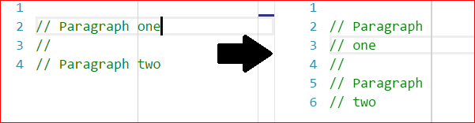
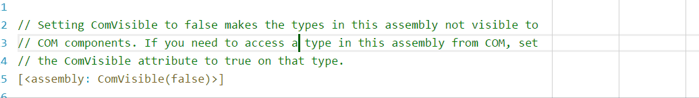

# Settings: Visual Studio #

Options are available in the standard Options dialog (Tools -> Options) under
the "Rewrap" category.

### Wrapping column ###

Set the column for wrapping; eg: a value of `80` will wrap after 80 characters. 

[Alternatively, leave blank if you want to use rulers/guides instead.](#wrapping-to-rulers)

### Wrapping whole or parts of comments ###

With "Wrap whole comments" set to `true` (default), Rewrap will wrap a whole comment block when
a text cursor is inside it.

But set to `false`, Rewrap will only wrap that paragraph within the
comment.

\
(Here the second paragraph is not wrapped)

**Note:** This setting only affects empty selections. You can always manually
select the lines to wrap.

### Double sentence spacing ###

The wrap/fill commands in Vim and Emacs have another feature, where if lines end
with a period (or ? or !), two spaces will be added after that sentence when the
paragraph is re-wrapped. Enabling this adds this feature.

[More info here](https://github.com/stkb/Rewrap/blob/master/specs/Basics/7-OtherFeatures.md#doublesentencespacing)

### Reformat (experimental) ###

This is an experimental setting that reformats paragraph indents when wrapping.
[More info
here](https://github.com/stkb/Rewrap/blob/master/specs/Detail/Indents-Reformat.md).

## Per-language settings ##

Per-language settings can be added by clicking on the "Add..." button at the end of the list. Choose the languages to add to the group, and set the options for the group as needed. If an option here is left blank the global setting will be used.

## Wrapping to rulers ##

To enable wrapping to rulers, the "Wrapping column" setting must be left blank.

  

Visual Studio doesn't come with a rulers feature, but you can use the extension [Editor Guidelines](https://marketplace.visualstudio.com/items?itemName=PaulHarrington.EditorGuidelines) to add them. With a guideline added in the editor, Rewrap will wrap to it. If you have multiple rulers, you can choose which ruler to wrap to while editing.

Just press Alt+Q multiple times to wrap to each ruler in turn. The ruler chosen is then remembered for that document for the rest of the session. It cycles through the rulers in the order in which they were added.

The multiple rulers feature is particularly useful in Visual Studio, where unlike VS Code, you can't have different rulers for different file types.
